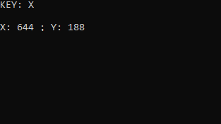

# CURSORPOS
A simple application that allows you to get cursor coordinates. To use, start the application, and then select the button (must be uppercase) to get the cursor position. 
 

# Usage
1. Run CURSORPOS
2. Select the key you want to get cursor position with (must be uppercase)
The results will display in the console
